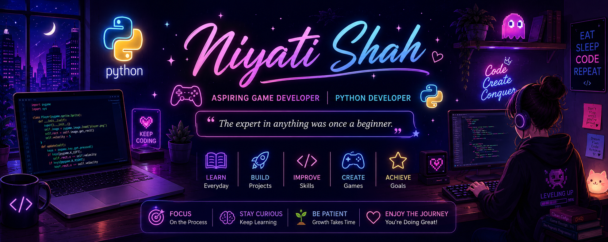

<p align="center">
  
</p>

<h1 align="center">👋 Hi, I'm Niyati Shah</h1>

<h3 align="center">
🐍 Aspiring Python Developer • 🎮 Aspiring Game Developer
</h3>

<p align="center">
  
</p>

---

# 🎮 PLAYER PROFILE

```text
👤 Player Name : Niyati Shah
🎖️ Class       : Python Explorer
🎮 Dream        : Game Developer
⭐ Level        : 03

XP
██████░░░░░░░░ 45%
```

---

# 🗺️ CURRENT QUESTS

- ✅ Learn Python
- ✅ Build Python Projects
- 🔄 Learn Object-Oriented Programming
- ⏳ Learn Data Structures
- ⏳ Learn Full Stack Development
- ⏳ Learn Unity
- 🎯 Get My First Software Internship

---

# 🎒 INVENTORY

<p align="center">


</p>

---

# ⚔️ SKILLS

| Skill | Progress |
|--------|----------|
| 🐍 Python | ███████░░░ 70% |
| 🔧 Git & GitHub | ██████░░░░ 60% |
| 💻 VS Code | █████████░ 90% |
| 🌐 HTML & CSS | ███░░░░░░░ 30% |
| 🎮 Unity | ░░░░░░░░░░ 0% |

---

# 🏆 ACHIEVEMENTS

- 🥇 Built a Python Calculator
- 🥈 Built a Grade Calculator
- 🚀 Sharing my coding journey on GitHub

---

# 📂 FEATURED PROJECTS

| 🚀 Project | 📖 Description |
|------------|----------------|
| 🧮 Calculator | Basic Calculator using Python |
| 🎓 Grade Calculator | Calculates grades based on marks |
| 🐍 Python Mini Projects | Practice projects while learning |

---

# 📊 GITHUB STATS

<p align="center">


</p>

---

# 🔥 GITHUB STREAK

<p align="center">


</p>

---

# 🎯 NEXT LEVELS

```text
🔓 Level 04 → Object-Oriented Programming
🔒 Level 05 → Data Structures & Algorithms
🔒 Level 06 → Full Stack Development
🔒 Level 07 → Unity Game Development
🔒 Level 08 → First Internship
🔒 Level 09 → First Game
🔒 Level 10 → Professional Game Developer
```

---

# 💬 FAVORITE QUOTE

> **"The expert in anything was once a beginner."**

---

# 🌱 CURRENTLY LEARNING

- 🐍 Python
- 📚 Object-Oriented Programming
- 🔧 Git & GitHub
- 🌐 Web Development

---

# 📫 CONNECT WITH ME

<p align="left">

<a href="YOUR_LINKEDIN_URL">

</a>

<a href="mailto:YOUR_EMAIL@gmail.com">

</a>

</p>

---

<p align="center">

### 🌟 Thanks for visiting my profile!

*"Every line of code brings me one step closer to becoming the developer I aspire to be."* 💜

</p>
